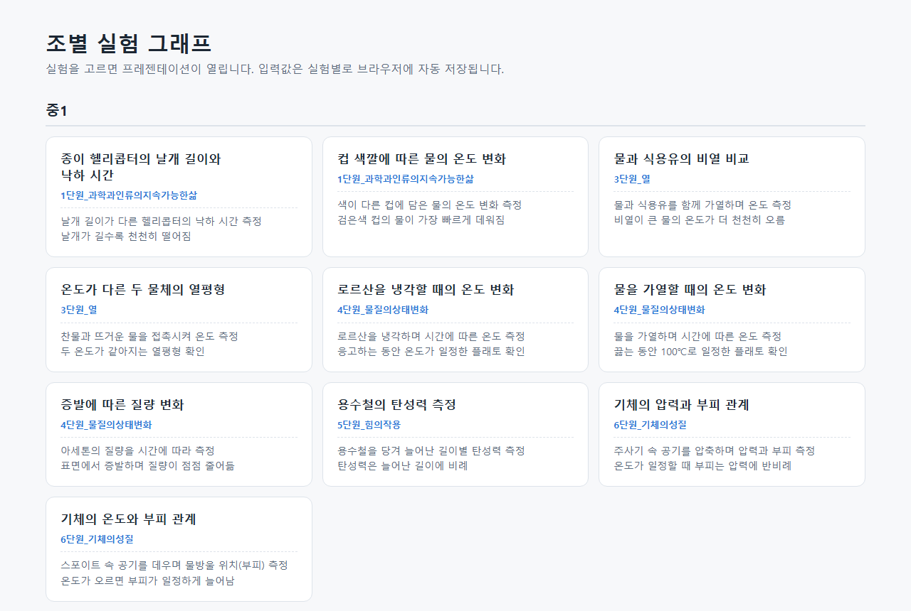
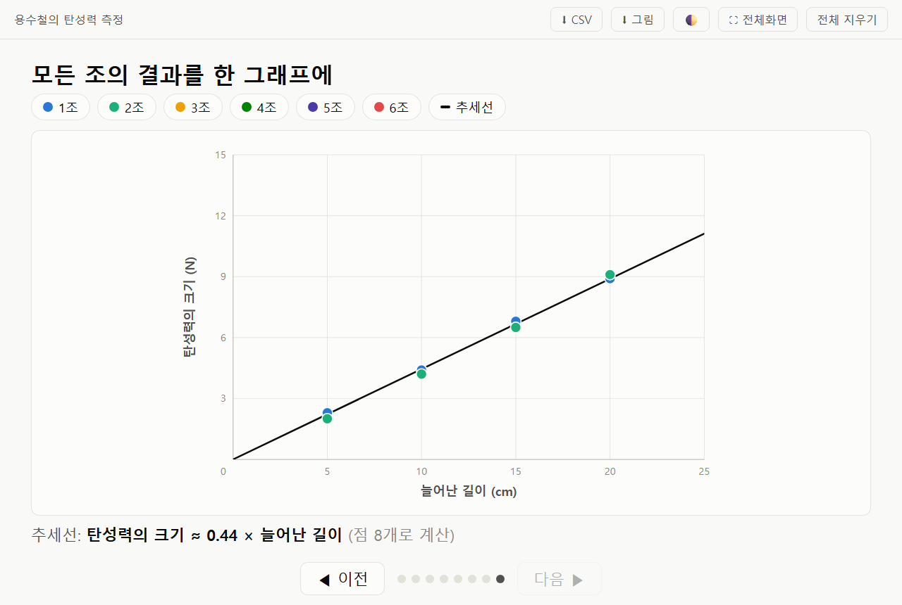

# 조별 실험 그래프 (Midsci lab graph)

중학교 과학 실험 시간에 **조별 측정값을 입력하면 표의 숫자가 그래프의 점으로
날아가 찍히고**, 학급 전체 데이터에 추세선까지 이어지는 수업용 프레젠테이션입니다.
설치도, 인터넷도 필요 없이 **HTML 파일 하나**로 동작합니다.

| 실험 선택 화면 | 종합 씬 (전체 조 + 추세선) |
|---|---|
|  |  |

## 바로 쓰기

- **파일 하나만 원하면**: [`dist/total.html`](dist/total.html)을 내려받으세요 —
  18개 실험 전부와 선택 화면이 한 파일(약 1MB)에 들어 있습니다.
- **실험별 파일**: [`dist/`](dist/) 폴더의 `index.html`(선택 화면)과 실험별 HTML.
  어느 파일이든 더블클릭으로 열립니다 (크롬·엣지 등 최신 브라우저).
- 저장소 **Settings → Pages**를 켜면 웹 주소로도 쓸 수 있습니다:
  `https://raphysicst-create.github.io/Midsci_lab_graph/dist/total.html`

## 수업 흐름

1. **도입** — 오늘 그래프의 가로축·세로축 소개 (빈 좌표평면)
2. **1~6조 입력** — 측정값을 넣고 Enter, 숫자가 그래프 위로 날아가 점이 됩니다
   (→/← 키 또는 화면 아래 버튼으로 씬 이동)
3. **종합** — 모든 조의 점을 한 그래프에 모으고, 버튼 한 번으로 추세선
   (비례·반비례·평균 곡선)과 관계식을 보여줍니다

- 입력값은 실험별로 브라우저에 자동 저장됩니다 (새로고침해도 유지 —
  다음 반 수업 전 우상단 **전체 지우기**).
- **CSV(엑셀)·PNG 내보내기**, 다크 모드, 전체화면을 지원합니다.
- 입력한 값은 어디로도 전송되지 않습니다 (브라우저 안에만 저장).

## 실험 목록 (18개)

| 학년 | 단원 | 실험 | 그래프 관계 |
|---|---|---|---|
| 중1 | 1단원 과학과인류의지속가능한삶 | 종이 헬리콥터의 날개 길이와 낙하 시간 | 직선 |
| 중1 | 1단원 (미래엔) | 컵 색깔에 따른 물의 온도 변화 | 평균 곡선 ×2계열 |
| 중1 | 3단원 열 | 물과 식용유의 비열 비교 | 평균 곡선 ×2계열 |
| 중1 | 3단원 열 | 온도가 다른 두 물체의 열평형 | 평균 곡선 ×2계열 |
| 중1 | 4단원 물질의상태변화 | 로르산을 냉각할 때의 온도 변화 | 평균 곡선 (플래토) |
| 중1 | 4단원 물질의상태변화 | 물을 가열할 때의 온도 변화 | 평균 곡선 (플래토) |
| 중1 | 4단원 물질의상태변화 | 증발에 따른 질량 변화 | 평균 곡선 (자유 입력) |
| 중1 | 5단원 힘의작용 | 용수철의 탄성력 측정 | 비례 |
| 중1 | 6단원 기체의성질 | 기체의 압력과 부피 관계 | 반비례 y=a÷x (자유 입력) |
| 중1 | 6단원 기체의성질 | 기체의 온도와 부피 관계 | 직선 (자유 입력) |
| 중2 | 1단원 물질의특성 | 로르산을 가열할 때의 온도 변화 | 평균 곡선 (플래토) |
| 중2 | 1단원 물질의특성 | 물의 양에 따른 최대 용해량 | 평균 곡선 ×2계열 |
| 중2 | 1단원 물질의특성 | 물체의 부피와 질량 (밀도) | 비례 (자유 입력) |
| 중2 | 1단원 물질의특성 | 혼합물 증류 시 온도 변화 | 평균 곡선 (이중 플래토) |
| 중2 | 5단원 식물과에너지 | 빛의 세기와 광합성량 | 평균 곡선 (포화) |
| 중2 | 7단원 전기와자기 | 전압과 전류의 관계 (옴의 법칙) | 비례 |
| 중2 | 8단원 별과우주 | 광원으로부터의 거리와 빛의 세기 | 반비례 y=a÷x² |
| 중2 | 8단원 별과우주 | 풍선 우주 팽창 모형 (허블 법칙) | 비례 |

측정 항목·고정값은 교과서 실험 절차를 근거로 했고, 교과서에 없는 제안값은
각 config의 `note`에 표시되어 있습니다 (교과서 본문·그림은 포함하지 않습니다).

## 새 실험 추가 / 수정

실험 1개 = `configs/<이름>.json` 1개입니다. JSON을 만들고 `py build.py`를
실행하면 `dist/`에 개별 앱·선택 화면·total.html이 다시 생성됩니다.

- 고정 x값(각 조는 y만 입력) / 자유 (x, y) 입력 / y 2계열 — 세 입력 모드
- 추세선: 비례(원점 통과)·직선·반비례(y=a÷xⁿ)·평균 곡선(플래토 등)·없음
- 필드 설명은 [`config.schema.json`](config.schema.json), 개발 규칙은
  [`CLAUDE.md`](CLAUDE.md) 참조. 테스트: `py test_build.py`(검증 규칙),
  `py test_smoke.py`(Playwright E2E).

다른 슬라이드에 끼워 넣을 때는 iframe 한 줄이면 됩니다 —
[`src/skeleton.html`](src/skeleton.html) 상단 주석에 3가지 방법이 있습니다.

## 라이선스

[MIT](LICENSE) — 라이선스 고지만 유지하면 자유롭게 사용·수정·재배포할 수 있습니다.
